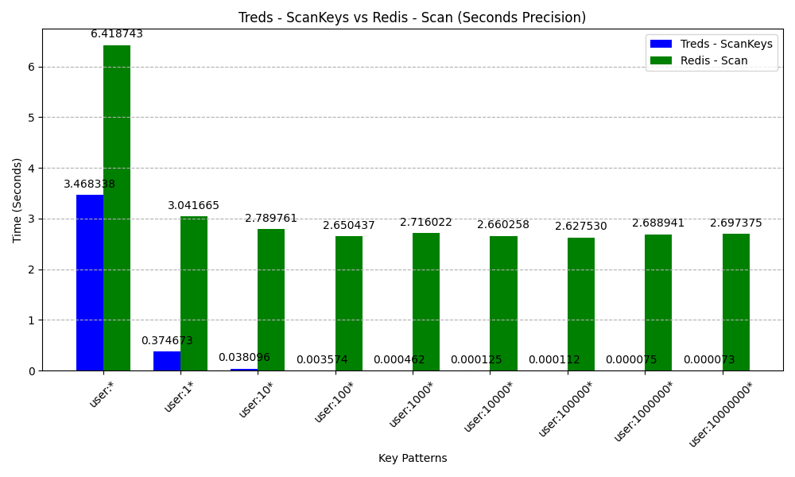
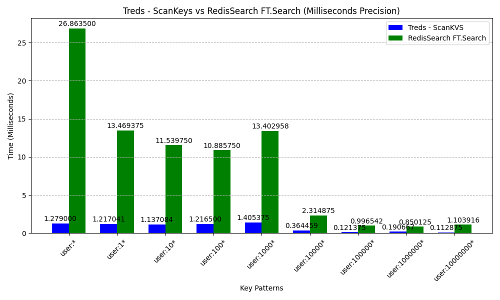
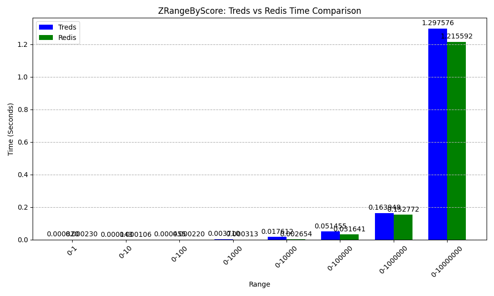
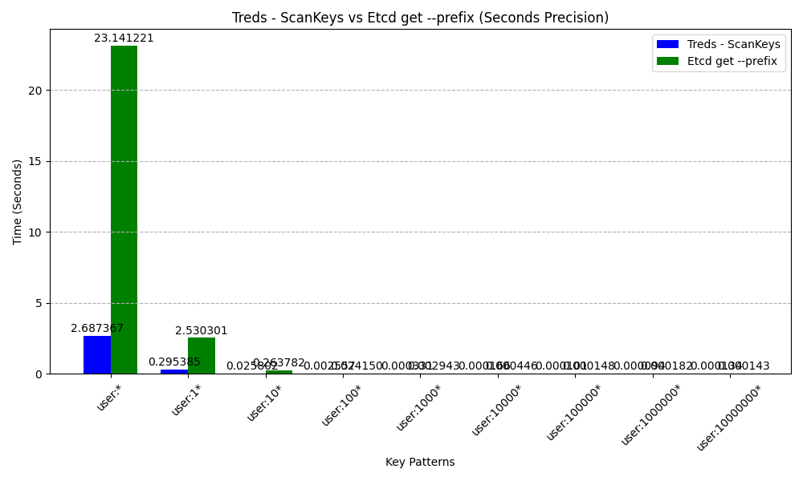

# Treds - Sorted Data Structure Server  [](https://github.com/absolutelightning/treds/actions/workflows/go.yml)

Treds is a Radix Trie based data structure server that stores keys in sorted order, ensuring fast and efficient retrieval.
A scan operation returns keys in their sorted sequence.

## How it is different from Redis?
* Keys at root level having a common prefix can be queried optimally
* `SCANKEYS/SCANKVS/KEYS/KVS` commands returns the results in sorted order
* Unlike [Redis KEYS](https://redis.io/docs/latest/commands/keys/), Treds `KEYS` has cursor and matches any valid regex expression also it returns count number of data if data is there
* Unlike [Redis SCAN](https://redis.io/docs/latest/commands/scan/), Treds `SCAN` **always** returns count number of data if data is there. Treds `SCAN` works on prefix only.
* Unlike [Redis ZRANGEBYLEX](https://redis.io/docs/latest/commands/zrangebylex/), Treds `ZRANGELEX` **always** returns data irrespective of score, basically data across different scores are returned
* Unlike [Redis PSUBSCRIBE](https://redis.io/docs/latest/commands/psubscribe), Treds `PSUBSCRIBE` is designed to work with channels having a common prefix
* It has Sorted Maps instead of Sorted Sets. So we can create a Sorted Key/Value pair with associated with a score
* New command - `DELPREFIX` - Deletes all keys having a common prefix and returns number of keys deleted
* New command - `LNGPREFIX` - Returns the key value pair in which key is the longest prefix of given string
* New command - `PPUBLISH` - Publish a message to all channels that have names with the given channel as their prefix
* Currently, it only has Key/Value store, Sorted Maps store, List store, Set store and Hash store and only supports strings/number as values

## Internals

It is single threaded and has event loop.
Implemented using modified Radix trees where leaf nodes are connected by Doubly Linked List in Radix Trie to facilitate the quick lookup of keys/values in sorted order.
Doubly Linked List of leaf nodes are updated at the time of create/delete and update of keys optimally.
This structure is similar to [Prefix Hash Tree](https://people.eecs.berkeley.edu/~sylvia/papers/pht.pdf), but for Radix Tree and without converting keys to binary.
Tree Map used to store score maps also are connected internally using Doubly Linked List using similar logic.
For more details - check out the [medium article](https://ashesh-vidyut.medium.com/optimizing-radix-trees-efficient-prefix-search-and-key-iteration-0c4fb817eac2)

## Performance Comparison
Both Treds and Redis are filled with 10 Million Keys in KeyValue Store and 10 Million Keys in a Sorted Map/Set respectively
Each key is of format `user:%d`, so every key has prefix `user:`
The commands are run in Golang program and redirecting the output to a file `go run main.go > out`.
For Redis setup see - [Redis Prefix Bench Repo](https://github.com/absolutelightning/redis-prefix-bench).
For Etcd setup see - [Etcd Prefix Bench Repo](https://github.com/absolutelightning/etcd-bench-prefix)

### Treds - ScanKeys vs Redis - Scan

Treds Command -
```bash
scankeys 0 prefix 100000000000
```

Redis Command - 
```bash
scan 0 match prefix count 100000000000 
```
This graph shows the performance comparison between Treds - ScanKeys and Redis - Scan:



### Treds - ScanKVS vs RedisSearch FT.SEARCH

Treds Command -
```bash
scankvs 0 prefix 1000
```

Redis Command -
```bash
FT.SEARCH idx:user prefix SORTBY name LIMIT 0 1000
```

Prefix for redis command can be replaced by "User*", "User1*", "User10*" ... etc

This graph shows the performance comparison between Treds - ScanKVS and Redis FT.Search:



### Treds - ZRangeScoreKeys vs Redis - ZRangeByScore
Treds Command -
```bash
zrangescorekeys key 0 max 0 100000000000 false
```

Redis Command -
```bash
zrangebyscore key 0 max
```
This graph shows the performance comparison between Treds - ZRangeScoreKeys and Redis - ZRangeByScore:




### Treds - ScanKeys vs Etcd - Get --prefix
Treds Command -
```bash
scankeys 0 prefix 100000000000
```

Etcd Command -
```bash
etcdctl get prefix --prefix --keys-only
```
This graph shows the performance comparison between Treds - ScanKeys and Etcd get --prefix command:




## Commands 
* `PING` - Replies with a `PONG`

#### Key/Value Store 
* `SET key value` - Sets a key value pair
* `GET key` - Get a value for a key
* `DEL key` - Delete a key
* `MSET key1 value1 [key2 value2 key3 value3 ....]`- Set values for multiple keys
* `MGET key1 [key2 key3 ....]`- Get values for multiple keys
* `DELPREFIX prefix` - Delete all keys having a common prefix. Returns number of keys deleted
* `LNGPREFIX string` - Returns the key value pair in which key is the longest prefix of given string 
* `DBSIZE` - Get number of keys in the db
* `SCANKEYS cursor prefix count` - Returns the count number of keys matching prefix starting from an index in lex order only present in Key/Value Store. Last element is the next cursor
* `SCANKVS cursor prefix count` - Returns the count number of keys/value pair in which keys match prefix starting from an index in lex order only present in Key/Value Store. Last element is the next cursor
* `KEYS cursor regex count` - Returns count number of keys matching a regex in lex order starting with cursor. Count is optional. Last element is the next cursor
* `KVS cursor regex count` - Returns count number of keys/values in which keys match a regex in lex order starting with cursor. Count is optional. Last element is the next cursor
* `EXPIRE key seconds` - Expire key after given seconds
* `TTL key` - Returns the time in seconds remaining before key expires. -1 if key has no expiry, -2 if key is not present.

#### Sorted Maps Store
* `KEYSZ cursor regex count` - Returns count number of keys in Sorted Maps Store matching a regex in lex order starting with cursor. Count is optional. Last element is the next cursor
* `ZADD key score member_key member_value [score member_key member_value ....]` - Add member_key with member value with score to a sorted map in key
* `ZREM key member [member ...]` - Removes a member from sorted map in key
* `ZCARD key` - Returns the count of key/value pairs in sorted map in key
* `ZSCORE key member` - Returns the score of a member in sorted map in key
* `ZRANGELEXKEYS key offset count withscore min max` - Returns the count number of keys are >= min and <= max starting from an index in a sorted map in lex order. WithScore can be true or false
* `ZRANGELEXKVS key offset count withscore min max` - Returns the count number of key/value pair in which keys are >= min and <= max starting from an index in a sorted map in lex order. WithScore can be true or false
* `ZRANGESCOREKEYS key min max offset count withscore` - Returns the count number of keys with the score between min/max in sorted order of score. WithScore can be true or false
* `ZRANGESCOREKVS key min max offset count withscore` - Returns the count number of key/value pair with the score between min/max in sorted order of score. WithScore can be true or false
* `ZREVRANGELEXKEYS key offset count withscore min max` - Returns the count number of keys are >= min and <= max starting from an index in a sorted map in reverse lex order. WithScore can be true or false
* `ZREVRANGELEXKVS key offset count withscore min max` - Returns the count number of key/value pair in which keys are >= min and <= max starting from an index in a sorted map in reverse lex order. WithScore can be true or false
* `ZREVRANGESCOREKEYS key min max offset count withscore` - Returns the count number of keys with the score between min/max in reverser sorted order of score. WithScore can be true or false
* `ZREVRANGESCOREKVS key min max offset count withscore` - Returns the count number of key/value pair with the score between min/max in reverse sorted order of score. WithScore can be true or false

#### List Store
* `KEYSL cursor regex count` - Returns count number of keys in List Store matching a regex in lex order starting with cursor. Count is optional. Last element is the next cursor
* `LPUSH key element [element ...]` - Adds elements to the left of list with key
* `RPUSH key element [element ...]` - Adds elements to the right of list with key
* `LPOP key count` - Removes count elements from left of list with key and returns the popped elements
* `RPOP key count` - Removes count elements from right of list with key and returns the popped elements
* `LREM key index` - Removes element at index of list with key
* `LSET key index element` - Sets an element at an index of a list with key
* `LRANGE key start stop` - Returns the elements from start index to stop index in the list with key
* `LLEN key` - Returns the length of list with key
* `LINDEX key index` - Returns the element at index of list with key

#### Set Store
* `KEYSS cursor regex count` - Returns count number of keys in Set Store matching a regex in lex order starting with cursor. Count is optional. Last element is the next cursor
* `SADD key member [member ...]` - Adds the members to a set with key
* `SREM key member [member ...]` - Removes the members from a set with key
* `SMEMBERS key` - Returns all members of a set with key
* `SISMEMBER key member` - Return 1 if member is present in set with key, 0 otherwise
* `SCARD key` - Returns the size of the set with key
* `SUNION key [key ...]` - Returns the union of sets with the give keys
* `SINTER key [key ...]` - Returns the intersection of sets with the given keys
* `SDIFF key [key ...]` - Returns the difference between the first set and all the successive sets.

#### Hash Store
* `KEYSH cursor regex count` - Returns count number of keys in Hash Store matching a regex in lex order starting with cursor. Count is optional. Last element is the next cursor
* `HSET key field value [field value ...]` - Sets field value pairs in the hash with key 
* `HGET key field` - Returns the value present at field inside the hash at key
* `HGETALL key` - Returns all field value pairs inside the hash at the key
* `HLEN key` - Returns the size of hash at the key
* `HDEL key field [field ...]` - Deletes the fields present inside the hash at the key
* `HEXISTS key field` - Returns a true or false based on field is present in hash at key or not
* `HKEYS key` - Returns all field present in the hash at key
* `HVALS key` - Returns all values present in the hash at key

#### Persistence
* `SNAPSHOT` - Persist the Key Value Store data on disk immediately.
* `RESTORE folder_path` - Restore the persisted snapshot on disk immediately.

#### Server
* `FLUSHALL` - Deletes all keys

#### Transaction
* `MULTI` - Starts a transaction
* `EXEC` - Execute all commands in the transaction and close the transaction
* `DISCARD` - Discard all commands in the transaction and close the transaction

#### PubSub
* `PUBLISH channel message` - Publish a message to a channel
* `SUBSCRIBE channel [channel ...]` - Subscribe to channels
* `UNSUBSCRIBE channel [channel ...]` - Unsubscribe to channels
* `PSUBSCRIBE channel [channel ...]` - Subscription receives all messages published to channels whose names are prefixes of the given channels.
* `PPUBLISH channel message` - This command publishes the message to all channels that have names with the given channel as their prefix.
* `PUBSUBCHANNELS prefix` - Returns all active channels having one or more subscribers, a common prefix with the given prefix. Prefix is optional.

While `PUBLISH` and `SUBSCRIBE` are similar to Redis, `PSUBSCRIBE` and `PPUBLISH` are designed to work with channels having a common prefix.
If a client subscribes to a channel named `NEWS-IND-KA-BLR` using `PSUBSCRIBE`, then the client will receive messages published
to channels `NEWS-IND-KA-BLR`, `NEWS-IND-KA`, `NEWS-IND`, `NEWS` using `PPUBLISH`.
In simple words - `PPUBLISH` publishes a message to all channels that have names with the given channel as their prefix and
`PSUBSCRIBE` receives all messages published to channels whose names are prefixes of the given channels.

#### Collection Store 
* `DCREATE collectionname schemajson indexjson` - Create a collection with schema and index
* `DDROP collectionname` - Drop a collection
* `DINSERT collectionname json` - Insert a document in a collection
* `DQUERY collectionname json` - Query a collection
* `DEXPLAIN collectionname json` - Explain a query - Returns the query plan - index with which query is executed
```text
DCREATE users "{\"name\": {\"type\": \"string\"}, \"age\": {\"type\": \"float\", \"min\": 18}, \"salary\": {\"type\": \"float\"}}" "[{\"fields\": [\"age\"], \"type\": \"normal\"}, {\"fields\": [\"salary\"], \"type\": \"normal\"}]"
DCREATE users "{\"name\": {\"type\": \"string\"}, \"age\": {\"type\": \"float\", \"min\": 18}, \"salary\": {\"type\": \"float\"}}" "[{\"fields\": [\"age\", \"salary\"], \"type\": \"normal\"}]"
DINSERT users "{\"name\": \"Spiderman\", \"age\": 13, \"salary\": 500}"
DINSERT users "{\"name\": \"Heman\", \"age\": 14, \"salary\": 600}"
DINSERT users "{\"name\": \"Superman\", \"age\": 15, \"salary\": 300}"
DINSERT users "{\"name\": \"Batman\", \"age\": 18, \"salary\": 900}"
DINSERT users "{\"name\": \"Antman\", \"age\": 25, \"salary\": 800}"
DEXPLAIN users "{\"filters\":[{\"field\":\"age\",\"operator\":\"$gt\",\"value\":14},{\"field\":\"salary\",\"operator\":\"$lt\",\"value\":900}]}"
DQUERY users "{\"filters\":[{\"field\":\"age\",\"operator\":\"$gt\",\"value\":14},{\"field\":\"salary\",\"operator\":\"$lt\",\"value\":900}]}"
```

#### Vector Store
* `VCREATE vectorname maxNeighbor levelFactor efSearch` - Create a vector store with maxNeighbor, levelFactor and efSearch
* `VDROP vectorname` - Drop a vector store
* `VINSERT vectorname float [float...]` - Insert a vector in a vector store
* `VSEARCH vectorname float [float...] k` - Search k nearest neighbors of a vector in a vector store using [HNSW algorithm](https://arxiv.org/pdf/1603.09320)
* `VDELETE vectorname string` - Delete a vector from a vector store, input is the vector id returned in `VINSERT` or `VSEARCH`
 
```text
VCREATE vec 6 0.5 100
VINSERT vec 1.0 2.0
VINSERT vec 2.0 3.0
VINSERT vec 3.0 4.0
VSEARCH vec 1.5 2.5 2 // Returns 2 nearest neighbors
```


## Run Local 

To run server run the following command on repository root

```bash
export TREDS_PORT=7997
go run main.go -port 7997
```

Using docker
```bash
docker run -p 7997:7997 absolutelightning/treds
```

`Default Port of Treds is 7997`
`If port is set in env variable as well as flag, flag takes the precedence.`

## Generating Binaries

To build the binary for the treds server, run following command in repo root - 
Binary named `treds` will be generated in repo root.

```bash
make build             
```
```bash
GOOS=linux GOARCH=arm64 make build
```

```bash
./treds
```

## CLI
Treds encodes and decodes the messages in RESP so redis-cli can be used to interact with Treds server.

```bash
redis-cli -p 7997
```

## Run Production

It is advised to run Treds cluster on production. To bootstrap a 3 node cluster, lets say we have 3 servers

Sever 1, Server 2 and Server 3

On Server 1 run

```bash
./treds -bind 0.0.0.0 -advertise ip-server-1 -servers 'uuid-server-2:ip-server-2:8300,uuid-server-3:ip-server-3:8300' -id uuid-server-1
```

On Server 2 run

```bash
./treds -bind 0.0.0.0 -advertise ip-server-2 -servers 'uuid-server-1:ip-server-1:8300,uuid-server-3:ip-server-3:8300' -id uuid-server-2
```

On Server 3 run

```bash
./treds -bind 0.0.0.0 -advertise ip-server-3 -servers 'uuid-server-1:ip-server-1:8300,uuid-server-2:ip-server-2:8300' -id uuid-server-3
```


## Future Work
* Currently only KV Store gets persisted in Snapshot, add support for other store.
* Authentication.
* Tests
* More Commands ...
