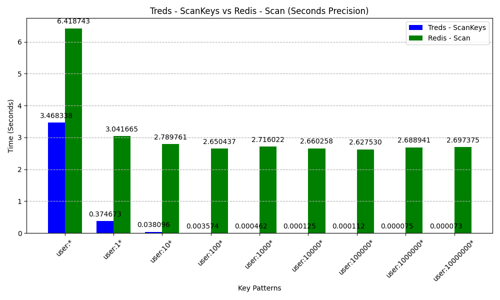
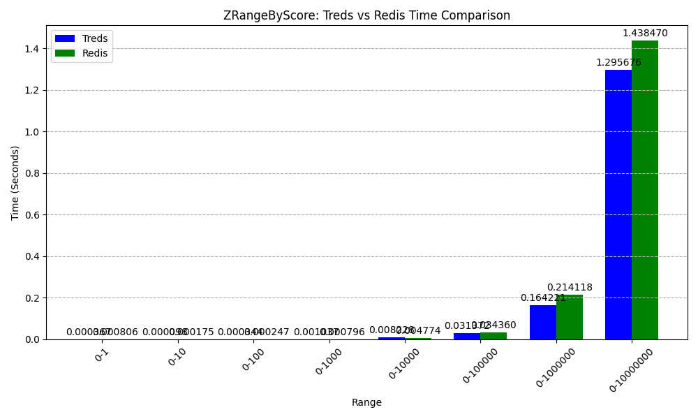

# Treds - Sorted Data Structure Server  [](https://github.com/absolutelightning/treds/actions/workflows/go.yml)

Treds is a Radix Trie based data structure server that stores keys in sorted order, ensuring fast and efficient retrieval.
A scan operation returns keys in their sorted sequence.

## How it is different from Redis?
* Keys at root level having a common prefix can be queried optimally
* `SCANKEYS/SCANKVS/KEYS/KVS` commands returns the results in sorted order
* Unlike [Redis SCAN](https://redis.io/docs/latest/commands/scan/), Treds SCAN **always** returns count number of data if data is there
* It has Sorted Maps instead of Sorted Sets. So we can create a Sorted Key/Value pair with associated with a score
* New command - `DELPREFIX` - Deletes all keys having a common prefix
* Currently, it only has Key/Value store, Sorted Maps store, List store, Set store and Hash store and only supports strings/number as values

## Internals

It is single threaded and has event loop.
Implemented using modified Radix trees where leaf nodes are connected by Doubly Linked List in Radix Trie to facilitate the quick lookup of keys/values in sorted order.
Doubly Linked List of leaf nodes are updated at the time of create/delete and update of keys optimally.
This structure is similar to [Prefix Hash Tree](https://people.eecs.berkeley.edu/~sylvia/papers/pht.pdf), but for Radix Tree and without converting keys to binary.
Tree Map used to store score maps also are connected internally using Doubly Linked List using similar logic

## Performance Comparison
Both Treds and Redis are filled with 10 Million Keys in KeyValue Store and 10 Million Keys in a Sorted Map/Set respectively

### Treds - ScanKeys vs Redis - Scan
This graph shows the performance comparison between Treds - ScanKeys and Redis - Scan:



### Treds - ZRangeScoreKeys vs Redis - ZRangeByScore
This graph shows the performance comparison between Treds - ZRangeScoreKeys and Redis - ZRangeByScore:



## Commands 
* `PING` - Replies with a `PONG`
* `SET key value` - Sets a key value pair
* `GET key` - Get a value for a key
* `DEL key` - Delete a key
* `MSET key1 value1 [key2 value2 key3 value3 ....]`- Set values for multiple keys
* `MGET key1 [key2 key3 ....]`- Get values for multiple keys
* `DELPREFIX prefix` - Delete all keys having a common prefix
* `DBSIZE` - Get number of keys in the db
* `SCANKEYS cursor prefix count` - Returns the count number of keys matching prefix starting from an index in lex order. Last element is the next cursor
* `SCANKVS cursor prefix count` - Returns the count number of keys/value pair in which keys match prefix starting from an index in lex order. Last element is the next cursor
* `KEYS regex` - Returns all keys matching a regex in lex order - (Not suitable to production use cases with huge number of keys)
* `KVS regex` - Returns all keys/values in which keys match a regex in lex order - (Not suitable to production use cases with huge number of keys)
* `ZADD key score member_key member_value [member_key member_value ....]` - Add member_key with member value with score to a sorted map in key
* `ZREM key member [member ...]` - Removes a member from sorted map in key
* `ZCARD key` - Returns the count of key/value pairs in sorted map in key
* `ZSCORE key member` - Returns the score of a member in sorted map in key
* `ZRANGELEXKEYS key offset count withscore prefix` - Returns the count number of keys matching prefix starting from an index in a sorted map in lex order. WithScore can be true or false
* `ZRANGELEXKVS key offset count withscore prefix` - Returns the count number of key/value pair in which keys match prefix starting from an index in a sorted map in lex order. WithScore can be true or false
* `ZRANGESCOREKEYS key min max offset count withscore` - Returns the count number of keys with the score between min/max in sorted order of score. WithScore can be true or false
* `ZRANGESCOREKVS key min max offset count withscore` - Returns the count number of key/value pair with the score between min/max in sorted order of score. WithScore can be true or false
* `ZREVRANGELEXKEYS key offset count withscore prefix` - Returns the count number of keys matching prefix starting from an index in a sorted map in reverse lex order. WithScore can be true or false
* `ZREVRANGELEXKVS key offset count withscore prefix` - Returns the count number of key/value pair in which keys match prefix starting from an index in a sorted map in reverse lex order. WithScore can be true or false
* `ZREVRANGESCOREKEYS key min max offset count withscore` - Returns the count number of keys with the score between min/max in reverser sorted order of score. WithScore can be true or false
* `ZREVRANGESCOREKVS key min max offset count withscore` - Returns the count number of key/value pair with the score between min/max in reverse sorted order of score. WithScore can be true or false
* `LPUSH key element [element ...]` - Adds elements to the left of list with key
* `RPUSH key element [element ...]` - Adds elements to the right of list with key
* `LPOP key count` - Removes count elements from left of list with key and returns the popped elements
* `RPOP key count` - Removes count elements from right of list with key and returns the popped elements
* `LREM key index` - Removes element at index of list with key
* `LSET key index element` - Sets an element at an index of a list with key
* `LRANGE key start stop` - Returns the elements from start index to stop index in the list with key
* `LLEN key` - Returns the length of list with key
* `LINDEX key index` - Returns the element at index of list with key
* `SADD member [member ...]` - Adds the members to a set with key
* `SREM member [member ...]` - Removes the members from a set with key
* `SMEMBERS key` - Returns all members of a set with key
* `SISMEMBER key member` - Return 1 if member is present in set with key, 0 otherwise
* `SCARD key` - Returns the size of the set with key
* `SUNION key [key ...]` - Returns the union of sets with the give keys
* `SINTER key [key ...]` - Returns the intersection of sets with the given keys
* `SDIFF key [key ...]` - Returns the difference between the first set and all the successive sets.
* `HSET key field value [field value ...]` - Sets field value pairs in the hash with key 
* `HGET key field` - Returns the value present at field inside the hash at key
* `HGETALL key` - Returns all field value pairs inside the hash at the key
* `HLEN key` - Returns the size of hash at the key
* `HDEL key field [field ...]` - Deletes the fields present inside the hash at the key
* `HEXISTS key field` - Returns a true or false based on field is present in hash at key or not
* `HKEYS key` - Returns all field present in the hash at key
* `HVALS key` - Returns all values present in the hash at key
* `FLUSHALL` - Deletes all keys
* `EXPIRE key seconds` - Expire key after given seconds
* `TTL key` - Returns the time in seconds remaining before key expires. -1 if key has no expiry, -2 if key is not present.

## Run 

To run server run the following command on repository root

```text
go run main.go 
```

For CLI run the following command in the `client` folder in the repo

```text
cd ./client
go run main.go 
```

## Future Work
* Add Raft for HA
* Transactions
* Pipelines
